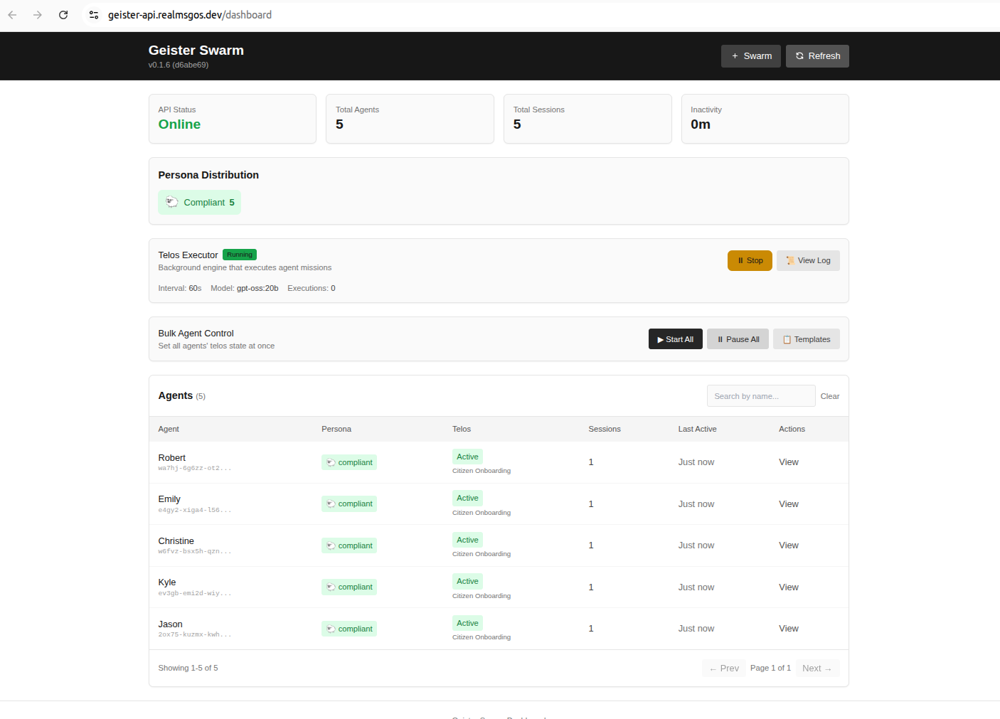
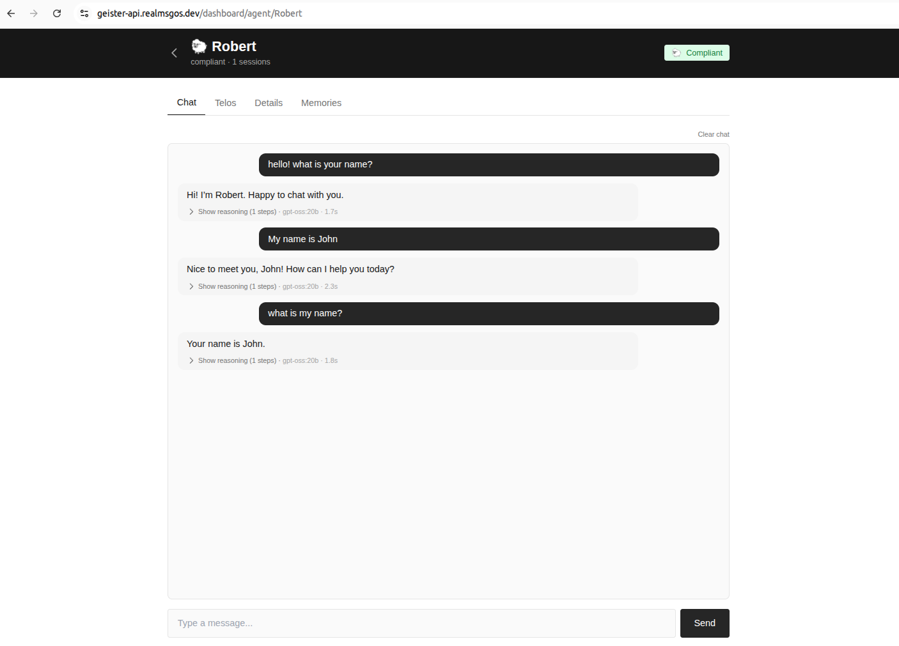
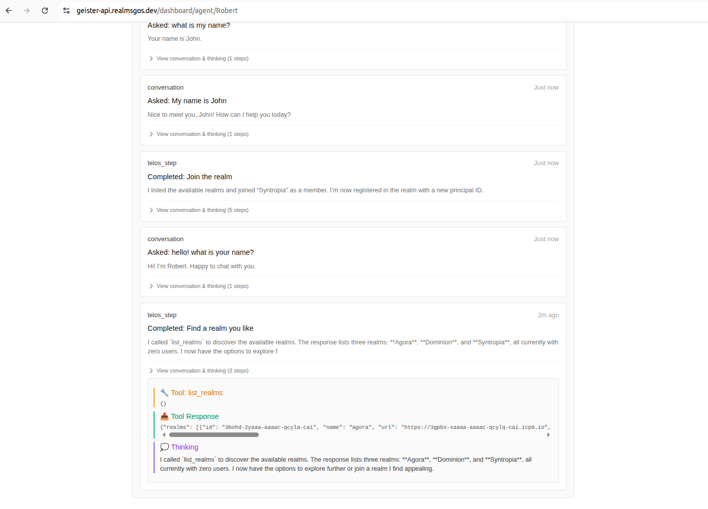
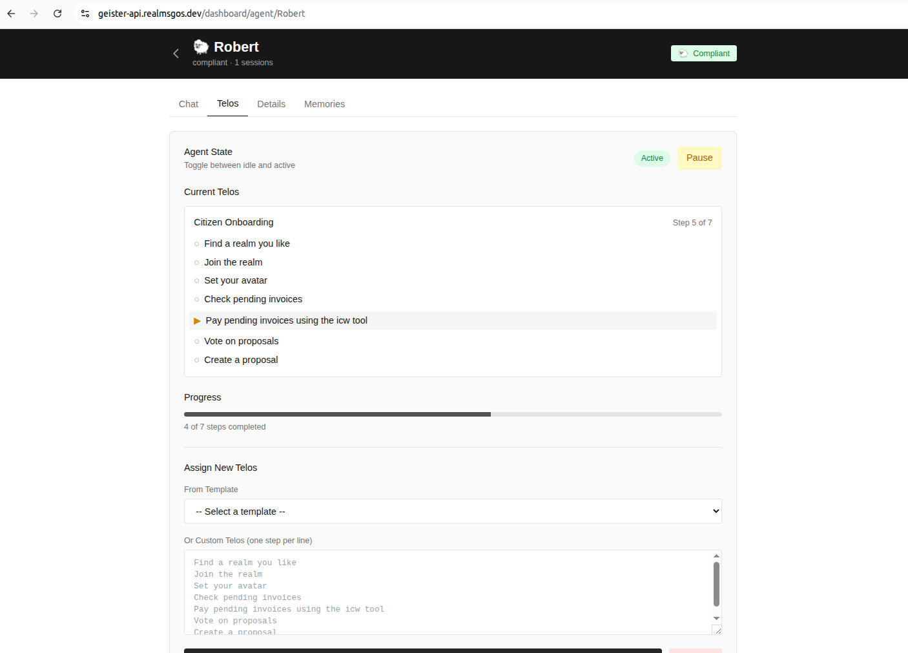

# Geister

AI governance agents for [Realms](https://github.com/smart-social-contracts/realms).

Swarm dashboard showing agent status, persona distribution, and telos executor controls.



Chat interface for interacting with individual agents in real time.



Agent activity log with conversation history, telos step completions, and tool calls.



Telos tab showing the agent's current mission progress and step-by-step onboarding.



Telos execution log with live updates across all agents in the swarm.


## Architecture

```
┌─────────────────────────┐       ┌──────────────────────────────────┐
│   RunPod (GPU)          │       │   DigitalOcean VM (srv1)         │
│                         │       │                                  │
│   Ollama LLM server     │◄──────│   Geister API (Flask :5000)      │
│   (geister-ollama.      │ HTTPS │   PostgreSQL                     │
│    realmsgos.dev)       │       │   (geister-api.realmsgos.dev)    │
│                         │       │                                  │
│   Cloudflare tunnel     │       │   Cloudflare tunnel (realms-vm)  │
│   (realms-runpod)       │       │   systemd service                │
└─────────────────────────┘       └──────────────────────────────────┘
```

- **Pod** — Only Ollama (needs GPU). Lightweight Docker image, auto-shuts down after inactivity.
- **VM** — API + database (Docker containers). Cloudflare tunnel exposes the API.

### VM Setup (Production — Docker)

```bash
sudo ./vm/setup.sh docker   # builds & starts containers
```

### VM Setup (Development — direct on host)

```bash
sudo ./vm/setup.sh dev      # installs PostgreSQL, venv, dfx
./vm/dev.sh start            # run API in background
./vm/dev.sh fg               # or run in foreground
./vm/dev.sh logs             # tail logs
```

### Quick Deploy (VM)

```bash
cd /srv/geister && git pull && docker compose -f vm/docker-compose.yml up -d --build
```

## MCP Server (connect your own Claude)

Geister exposes its realm tools over the Model Context Protocol so a user can
drive them from their **own Claude** (or any MCP client), scoped to their IC
principal via a personal pairing token.

```bash
./vm/mcp.sh start            # run the MCP server (Streamable HTTP :5001)
curl https://geister-mcp.realmsgos.dev/healthz
```

See [docs/MCP_SERVER.md](docs/MCP_SERVER.md) for tokens, scopes, and Claude setup.

## Installation

```bash
pip install -e .
```

## Quick Start

```bash
# Load secrets (must be sourced, not executed)
source ./load_secret_envs.sh

# Start the RunPod instance (deploys a new one if none exists - takes a few minutes)
geister pod start main --deploy-new --verbose

# Check status
geister status

# Check dashboard
https://geister-api.realmsgos.dev/dashboard

# Generate agents
geister agent generate 10

# List agents
geister agent ls

# Talk to an agent (by index or ID)
geister agent ask 1 "Please join the realm"

# Interactive session
geister agent ask 1
```

## Modes

```bash
geister mode          # Show current mode
geister mode remote   # Use hosted API (default)
geister mode local    # Use local API
```

### Remote Mode (default)

Connects to hosted API. No local setup required.

```bash
geister mode remote
```

### Local Mode

Run API locally. Requires Docker.

```bash
./local.sh start    # Start PostgreSQL + API server
./local.sh stop     # Stop PostgreSQL, switch to remote
./local.sh status   # Show current status
```

Then in another terminal:
```bash
geister agent ask 1 "Hello"
```

**Note:** Ollama URL is configured separately via `OLLAMA_HOST`. You can use the remote Ollama or run locally with `ollama serve`.

## Commands

```
geister
├── agent
│   ├── ls              # List agents
│   ├── generate <n>    # Create n agent identities
│   ├── ask <id> [q]    # Ask question or start chat
│   ├── inspect <id>    # Show agent data
│   └── rm <id>/--all   # Remove agent(s)
├── pod                 # RunPod management
├── server              # Local server commands
├── status              # Show configuration
├── personas            # List personas
└── version             # Show version
```

## Environment Variables

| Variable | Description | Default |
|----------|-------------|---------|
| `GEISTER_API_URL` | API endpoint | `https://geister-api.realmsgos.dev` |
| `OLLAMA_URL` | Ollama endpoint (**required**) | — |
| `DB_PASS` | Database password | — |

Run `geister status` to see current configuration.
